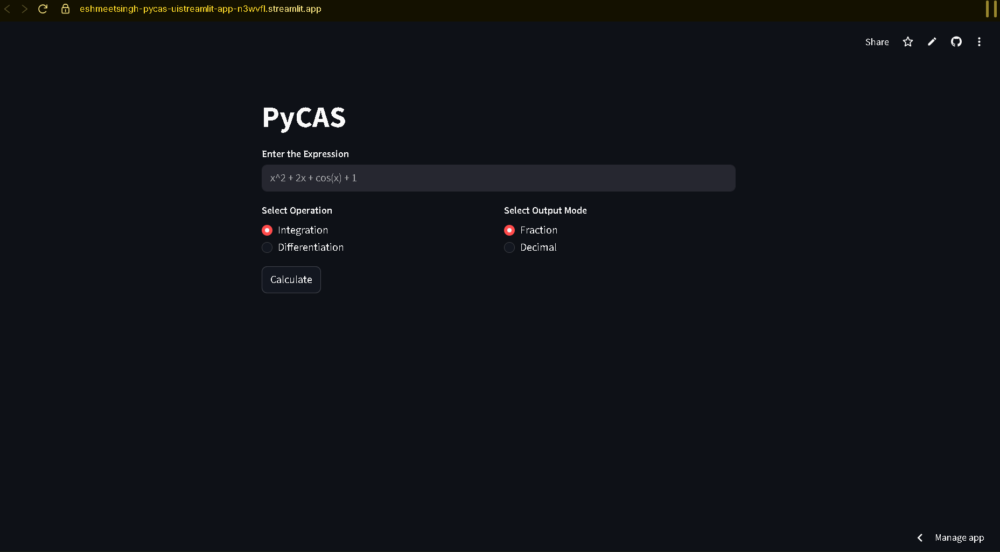
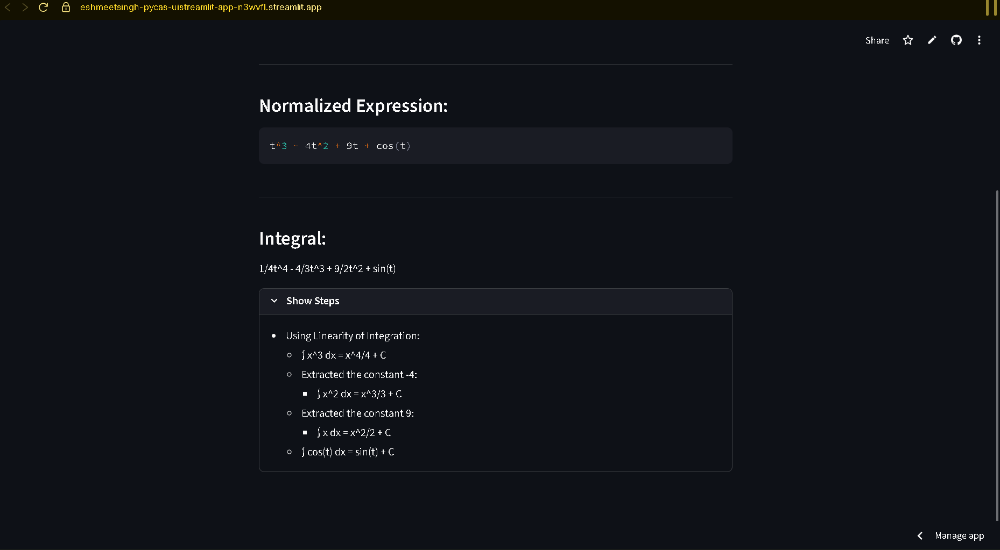
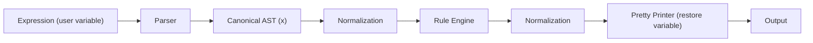

# PyCAS — A Symbolic Math Engine That Refuses to Guess

Most symbolic math tools try to “handle everything” — often by making silent assumptions.

**PyCAS does the opposite.**

It operates on a strictly defined algebraic domain, enforces structural invariants at every stage, and explicitly rejects anything it cannot guarantee to be correct.

> No heuristics. No silent fallbacks. No guesswork.

---

## 🚀 Live Demo

👉 https://eshmeetsingh-pycas-uistreamlit-app-n3wvfl.streamlit.app

Try:
- `x^2 + 2x + 1`
- `sin(x) + x^2`
- `exp(x) + cos(x)`

## 👀 Demo Preview



Example shown:
- Expression normalization
- Symbolic integration
- Step-by-step rule application

---

## ⚡ What PyCAS Does

- Parses expressions into a canonical AST (7 node types)  
- Handles 11 distinct input forms (implicit multiplication, unary minus, powers, functions, etc.)  
- Enforces 13 structural invariants across all transformations  
- Performs rule-based symbolic differentiation and integration  
- Produces exact results using rational arithmetic  
- Validated on 30 expressions:
  - 28 exact results  
  - 2 explicitly rejected (by design)  
  - 0 silent failures  

---

## 🔄 Execution Model



---

## 🧪 Example

**Input**
```
sin(x) + x^2
```

**Derivative**
```
cos(x) + 2x
```

**Unsupported**
```
sin(x^2)
→ Rejected (chain rule not supported)
```

---

## 🧮 Supported Domain

PyCAS operates over a strict single-variable algebraic domain:

- Constants  
- One variable  
- Monomials (`x^n`, n ≥ 0)  
- Constant multiples  
- Sums  
- Products (normalized form)  
- Elementary functions:
  - `sin(x)`  
  - `cos(x)`  
  - `exp(x)`  

Anything outside this domain is **explicitly rejected**.

---

## ⚠️ What PyCAS Does NOT Do

- No chain rule  
- No multivariable calculus  
- No heuristic simplification  
- No silent approximations  

If it cannot guarantee correctness, it **fails**.

---

## 📊 System Properties

- AST Node Types: 7  
- Input Forms Supported: 11  
- Invariants Enforced: 13  
- Test Coverage: 30 expressions  
- Silent Failures: 0  

---

## 🧠 Design Philosophy

- Correctness over coverage  
- Explicit invariants over ad-hoc simplification  
- Canonical representations  
- Clear separation of concerns  
- No silent fallbacks  

---

## 🔤 Variable Handling

PyCAS is internally a **single-variable system**, but remains **variable-agnostic for the user**.

- Any input variable is accepted (`x`, `t`, `y`, etc.)
- Internally, all expressions are canonicalized to a single variable (`x`)
- All parsing, normalization, and rule application operate on this canonical form
- During output, the original variable name is restored

### Example

Input:
```
t^2 + 2t
```

Internal representation:
```
x^2 + 2x
```

Derivative:
```
2x + 2
```

Output:
```
2t + 2
```

---

This design allows:
- simpler rule definitions
- consistent invariants
- separation between computation and presentation

## 🏗 Architecture Overview

### Parser
- Recursive-descent parser  
- Handles implicit multiplication (`2x`, `xsin(x)`)  
- Converts input → AST  
- Performs desugaring (`sin^2(x)` → `(sin(x))^2`)  

### AST

```
{"type": "const", "value": number}
{"type": "var", "variable": "x"}
{"type": "power", "base": <var>, "exp": n}
{"type": "mul", "const": c, "expr": <expression>}
{"type": "prod", "factors": [...]}
{"type": "sum", "terms": [...]}
{"type": "func", "name": "sin|cos|exp", "arg": <var>}
```

### Normalization
- Flattens nested structures  
- Combines terms  
- Enforces canonical ordering  
- Eliminates redundancy  

### Invariants
- No nested `mul`  
- At most one constant per product  
- Functions only accept atomic variables  
- Only supported function names allowed  

### Rule Engine

**Differentiation**
- Linearity  
- Power rule  
- Constant multiple  
- `sin`, `cos`, `exp`  

**Integration**
- Same rule set  

Unsupported operations → explicit failure  

---

## 📜 Formal Specification

PyCAS includes a formal AST and normalization specification:

- Defines all node types  
- Specifies structural invariants  
- Enforces normalization rules and semantics  

See: `examples/AST_spec.txt`

This specification ensures that:
- all transformations operate on a canonical representation  
- invariants are preserved across parsing, differentiation, and integration  
- no structurally invalid expressions can exist post-normalization  

> The system is designed such that implementation follows specification — not the other way around.

---

## 🖥 UI

- Built with Streamlit  
- Pure presentation layer  
- No computation logic in UI  

---

## 📂 Project Structure

```
PyCAS/
├── src/pycas/
│   ├── core.py
│   ├── parser.py
│   ├── normalizer.py
│   ├── normalizer_rules.py
│   ├── rules.py
│   ├── pretty_printer.py
│   └── errors.py
│
├── ui/
│   └── streamlit_app.py
│
├── examples/
│   ├── demo.py
│   ├── invariants.py
│   └── AST_spec.txt
```

---

## 🔮 Future Work

PyCAS is intentionally constrained to preserve correctness and structural guarantees.  
Future extensions must respect these design principles.

### Calculus Extensions
- Chain rule support (requires non-atomic function arguments and AST generalization)  
- Product rule for non-atomic expressions  
- Expanded function support (log, tan, etc.)  

### Domain Expansion
- Multi-variable expressions (would require redefining normalization and invariants)  
- Broader expression classes beyond monomials and atomic products  

### System Enhancements
- Step-by-step transformation tracing (rule-level explanations)  
- More comprehensive test suite across edge cases  
- Formal verification of invariants  

### Architecture Evolution
- Pluggable rule system for extending calculus rules safely  
- Stronger error classification and reporting  

---

> Any extension must preserve PyCAS’s core guarantee:  
> **No silent failures and no heuristic approximations.**

---

## 📌 Why This Project Exists

PyCAS is a discipline-driven systems project focused on:

- invariant-driven design  
- canonical representations  
- rule-based symbolic computation  
- correctness through restriction  

---

## 👤 Author

Eshmeet Singh
